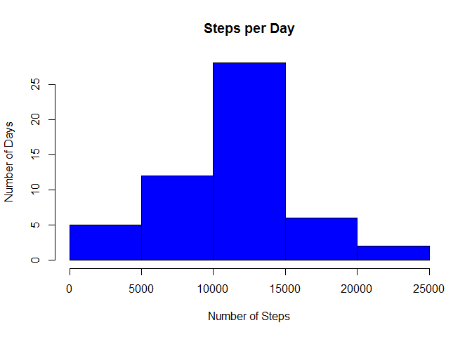
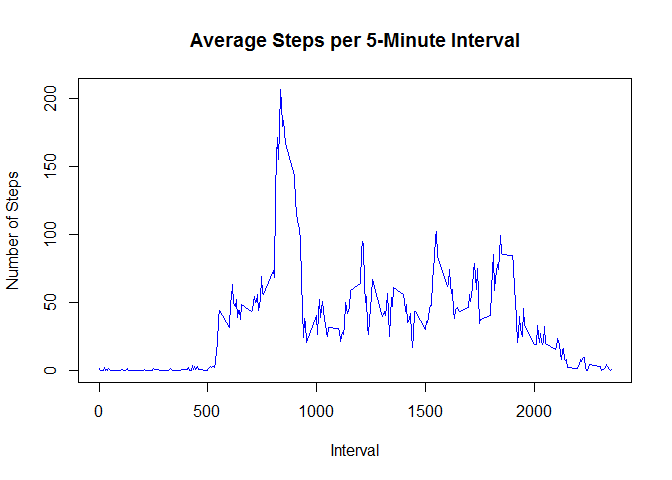
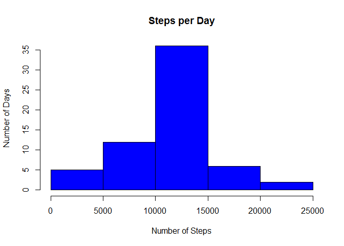

# Reproducible Research: Peer Assessment 1


## Loading and preprocessing the data
### 1. Loading the data

```r
# Unzip the data
if (file.exists("activity.csv")) {  
    message("Data already unzipped") 
} else {message("Extracting data") 
    unzip(zipfile="activity.zip")
}
```

```
## Data already unzipped
```

```r
# Load the data
data <- read.csv("activity.csv")
```

### 2. Subset the data to include only complete cases

```r
completedata <- subset(data, complete.cases(data)==TRUE)
```

## What is mean total number of steps taken per day?
### 1. Calculating the total number of steps taken each day

```r
library(plyr)
dailysteps<-ddply(completedata, .(date), summarize, steps=sum(steps))
```

### 2. Creating the plot

```r
hist(dailysteps$steps, main="Steps per Day", 
     xlab="Number of Steps", ylab = "Number of Days", col="blue")
```

<!-- -->

### 3. Calculating the mean and median
mean

```r
mean(dailysteps$steps)
```

```
## [1] 10766.19
```

median

```r
median(dailysteps$steps)
```

```
## [1] 10765
```

## What is the average daily activity pattern?
### 1. Making a time series plot of the 5-minute interval and the average number of steps taken, averaged across all days
Calcluating the average number of steps taken in each 5-minute intervals

```r
interval_average <- ddply(completedata, .(interval), summarize, 
                          steps=mean(steps))
```

Creating the plot

```r
plot(interval_average, type="l", main="Average Steps per 5-Minute Interval", 
     xlab="Interval", ylab="Number of Steps", col="blue")
```

<!-- -->

### 2. Calculating the 5-minute interval with the highest average number of steps

```r
interval_average[which.max(interval_average$steps),]
```

```
##     interval    steps
## 104      835 206.1698
```

## Imputing missing values
### 1. Calculating the total number of missing values

```r
sum(complete.cases(data)==FALSE)
```

```
## [1] 2304
```

### 2. Devising a strategy to fill in the missing values
Replace all N/As with the average value for that 5-minute interval

### 3. Creating a new data set with the missing values filled in

```r
imputeddata <- data

for (i in 1:nrow(imputeddata)){
    if (is.na(imputeddata$steps[i])){
        imputeddata$steps[i] <- 
            interval_average$steps[which(imputeddata$interval[i]
                                         == interval_average$interval)]}
}
```

### 4. Making a histogram of the total number of steps taken each day and calculating the mean and median total number of steps taken per day.
Calculating the total number of steps taken each day

```r
dailysteps_imputed<-ddply(imputeddata, .(date), summarize, steps=sum(steps))
```

Creating the plot

```r
hist(dailysteps_imputed$steps, main="Steps per Day", 
     xlab="Number of Steps", ylab = "Number of Days", col="blue")
```

<!-- -->

Calculating the mean

```r
mean(dailysteps_imputed$steps)
```

```
## [1] 10766.19
```

Calculating the median

```r
median(dailysteps_imputed$steps)
```

```
## [1] 10766.19
```
By imputing the data, the mean stays exactly the same, and the median increases 
negligably. Though imputing the data does not impact the number of steps taken 
each day, it does increase the frequency (number of observations). This makes
sense, since imputing the data increases the size of the data set.

## Are there differences in activity patterns between weekdays and weekends?
### 1. Creating a new factor variable indicating whether a date is a weekday or weekend

```r
imputeddata$weekday <- weekdays(as.Date(imputeddata$date))
for (i in 1:nrow(imputeddata)) { 
    if (imputeddata[i,]$weekday %in% c("Saturday","Sunday")) {
        imputeddata[i,]$weekday<-"weekend"
    }
    else{
        imputeddata[i,]$weekday<-"weekday"
    }
}
```

### 2. Making a panel plot containing a time series plot of the 5-minute interval and the average number of steps taken, averaged across all weekday days or weekend days
Calcluating the average number of steps taken in each 5-minute intervals

```r
imputed_interval_average <- ddply(imputeddata, .(interval, weekday), summarize, 
                          steps=mean(steps))
```

Creating the plot

```r
library(lattice)
xyplot(steps ~ interval | weekday, data = imputed_interval_average, type="l", 
       layout = c(1,2), xlab = "Interval", ylab = "Number of steps")
```

<!-- -->
